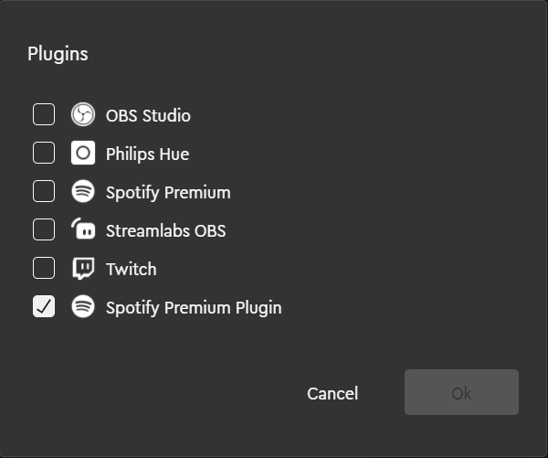
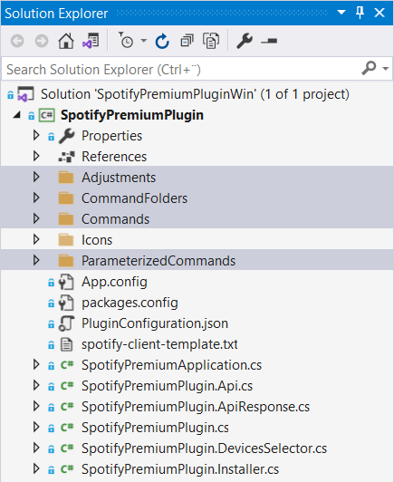
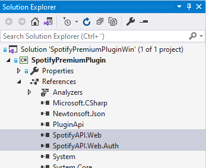
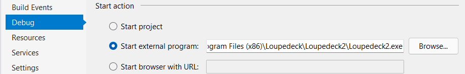
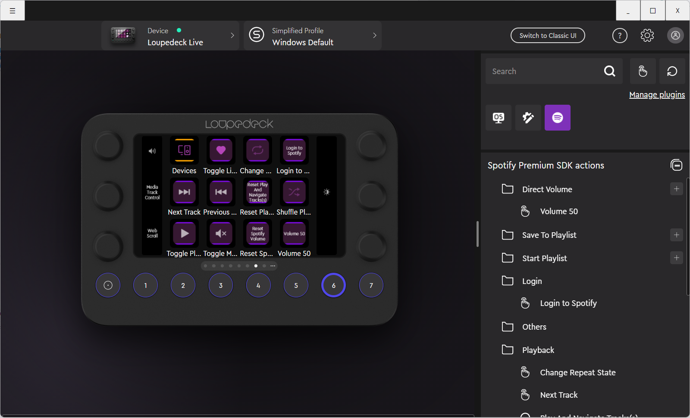
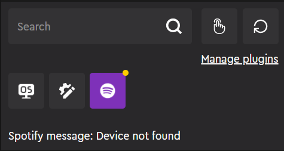

# Spotify Premium Plugin

Spotify plugin for Loupedeck software, based on [Loupedeck Plugin SDK](https://developer.loupedeck.com/docs). See [Developing plugins for Loupedeck - Process overview](https://developer.loupedeck.com/docs/Process-overview)

It is recommended to use Loupedeck software version 5.0 or newer.

## Restrictions for Spotify Plugin
Loupedeck software comes with an "internal" Spotify Premium plugin that does not use SDK Plugin API. [Spotify Premium SDK](https://github.com/Loupedeck/SpotifyPremiumPlugin) solution uses SDK Plugin API and contains the same functionality as the "internal" plugin.

🛑 It is not possible to use both "internal" and SDK Spotify Premium plugin versions at the same time. Select only Spotify Premium SDK from Manage Plugins.  

<p align="center">
  
</p>

The reason for this is that currently SDK plugins cannot use the same dll as Loupedeck application is using. In this case e.g., a modified version of [SpotifyAPI-NET](https://github.com/Loupedeck/SpotifyAPI-NET) which is used to communicate with Spotify Web API. SDK Plugin must reference the [SpotifyAPI-NET](https://github.com/Loupedeck/SpotifyAPI-NET) dlls within Loupedeck installation:
```csharp
<INSTALLATION PATH>\Loupedeck\Loupedeck2\SpotifyAPI.Web.dll
<INSTALLATION PATH>\Loupedeck\Loupedeck2\SpotifyAPI.Web.Auth.dll
```
Hence it's not possible to upgrade this plugin to use latest version of [SpotifyAPI-NET](http://johnnycrazy.github.io/SpotifyAPI-NET).  

## Solution description
Solution was created using the [Plugin Generator tool](https://github.com/Loupedeck/Loupedeck4PluginSdkCopy/wiki/Creating-the-project-files-for-the-plugin)

```
<TOOL LOCATION>\LoupedeckPluginTool.exe g -name=SpotifyPremium
```

Repository contains solution for Windows, **SpotifyPremiumPluginWin.sln**. 

Main functionality is in SpotifyPremiumPlugin.cs and partial classes. Actions are under folders
```
Adjustments
CommandFolders
Commands
ParameterizedCommands
```
<p align="center">
  
</p>

DLLs referencing Loupedeck installation, see [Restrictions for Spotify plugin usage](#Restrictions-for-Spotify-plugin) 
```
SpotifyAPI.Web
SpotifyAPI.Web.Auth
```
<p align="center">
  
</p>

### VS Build Configuration for Debugging

SpotifyPremiumPlug.csproj
```
  <PropertyGroup Condition=" '$(Configuration)|$(Platform)' == 'Debug|AnyCPU' ">
    ...
    <OutputPath>$(LocalAppData)\Loupedeck\Plugins\</OutputPath>
    ...
  </PropertyGroup>
  ```

  <p align="center">
  
</p>

### Spotify Client Configuration
To access [Spotify Web API](https://developer.spotify.com/documentation/web-api/quick-start/), first create a simple server-side application. Then add the Client Id and Secret, and port to the configuration file:
```
%LOCALAPPDATA%/Loupedeck/PluginData/SpotifyPremium/spotify-client.txt
```
See example project file **spotify-client-template.txt**

Port(s) must correspond to that on the Spotify developers's configuration.


🛑 IMPORTANT! This plugin uses Spotify Client Id and Secret that are read from text file. DO NOT DISTRIBUTE THIS FILE.


For creating distributable Spotify plugin, use [Authorization code flow with PKCE](https://developer.spotify.com/documentation/general/guides/authorization/code-flow/). This concept is currently untested, but e.g.,
1. Upgrade to latest [SpotifyAPI-NET](http://johnnycrazy.github.io/SpotifyAPI-NET) version and implement Authorization code flow with PKCE.
2. Add automation to disable/remove *SpotifyPlugin.dll*, *SpotifyAPI.Web.dll*, *SpotifyAPI.Web.Auth.dll* from Loupedeck software installation folder.


## Creating Installation Package for Loupedeck software 5.0 or newer
Loupedeck 5.0 comes with Loupedeck Plugin Package Installer (LoupedeckPluginPackageInstaller.exe) that can install and uninstall plugins.

The input for Loupedeck Plugin Package Installer is a ZIP archive with .lplug4 extension. Douple click the .lplug4 file will start plugin install with Loupedeck software 5.0 or newer.

ZIP archive must contain a LoupedeckPackage.yaml file with plugin manifest in YAML format.

Recommended archive structure:
```
/LoupedeckPackage.yaml   -- plugin manifest
/bin/win/                -- binaries for Windows version
/bin/mac/                -- (binaries for Mac version)
```
The YAML manifest has the following format (user modifiable fields are in <> brackets)
```
type: plugin4
name: <Name of the plugin>
displayName: <Display name of the plugin>
version: <version string>
author: <author id>
copyright: <copyright>

supportedDevices: <Note if you support only one, remove another>
    - LoupedeckCt  
    - LoupedeckLive

pluginFileName: <Plugin file name>
pluginFolderWin: <Folder for windows binaries within zip file>
pluginFolderMac: <Folder for mac binaries within zip file>
```

Example LoupedeckPackage.yaml for Spotify Premium SDK:
```
type: plugin4
name: SpotifyPremium
displayName: Spotify Premium SDK
version: 1.0
author: Loupedeck
copyright: Loupedeck

supportedDevices:
    - LoupedeckCt  
    - LoupedeckLive

pluginFileName: SpotifyPremiumPlugin.dll
pluginFolderWin: bin\win\
pluginFolderMac: bin\mac\
```

## Plugin usage with Loupedeck software and devices
To use plugin, first select it in Loupedeck software. See  [Restrictions for Spotify plugin usage](#Restrictions-for-Spotify-plugin) 

Add action **Login to Spotify** or any other action. All will open browser for user to login with Spotify. Note that user must have Spotify Premium subscription.

  <p align="center">
  
</p>

Possible problems with plugin/Spotify API will display warning (yellow dot in plugin icon) and error (red dot) messages.

  <p align="center">
  
</p>
